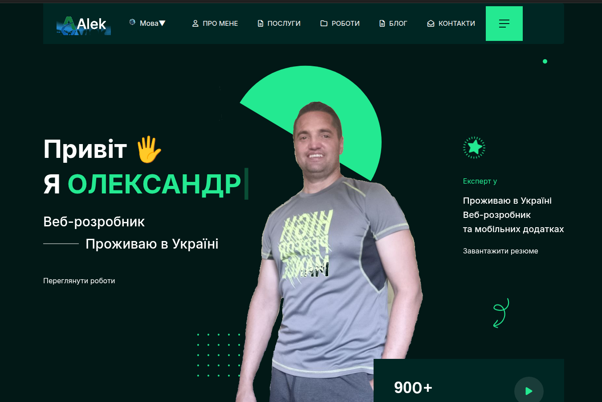
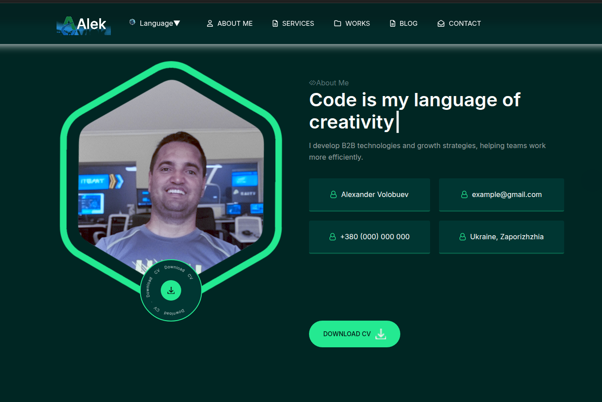

<div align="center">

# 🎨 Портфолио — Александр Волобуев  
### Frontend Developer (React / JavaScript)

---

[]()
[]()
[]()

---

## 🔗 Live Demo  
👉 **https://your-demo-link.com**  
_(вставь свою ссылку — я заменю)_

---

## 🖼️ Скриншоты

### 🌟 Главная страница


### 📌 Пример секции


_(можешь прислать скрин — я поставлю настоящий)_

</div>

---

# 📌 О проекте

Современное многостраничное портфолио, разработанное на **React + Vite**,  
со стилизацией через **SCSS**, анимациями, магическим курсором, мультиязычностью и эффектами текстов.

Проект создан для демонстрации навыков фронтенд-разработки и UI-проекта.

---

# 🚀 Используемые технологии

- **React 18**
- **Vite**
- **JavaScript (ESNext)**
- **SCSS Modules**
- **i18next** (RU / EN / UA)
- **Framer Motion / GSAP-анимации**
- **Адаптивная верстка**
- **Lazy-loading изображений**
- **Модульная архитектура**


## 📦 Установка и запуск

### 1. Установить зависимости
```bash
npm install
```
---
### 2. Запустить проект в режиме разработки
```bash
npm run dev
```
---
### 3. Собрать продакшен-версию
```bash
npm run build
```
---
### 4. Протестировать сборку локально
```bash 
npm run preview
```
---
### 🌍 Мультиязычность

Проект использует i18next.
Поддерживаемые языки:

🇷🇺 Русский

🇬🇧 Английский

🇺🇦 Украинский

Переключатель языка встроен в интерфейс.

### 🖼️ Секции

Проект включает:

Hero Section

About Section

Resume / Experience

Services

Portfolio / Projects

Blog

Testimonials

Pricing

Brand

Contact

Footer

Preloader

Magic Cursor

Animated Text (Spring, Wave, Typed, Odometer)

Каждая секция — отдельный компонент.

### 🛠️ SCSS Архитектура

Структура:

base/ — переменные, типографика, миксины

reset/ — сбросы и базовые UI-паттерны

utilites/ — утилитарные стили, анимации

template/ — стили секций

spacing/ — отступы

styles/ — основные стили

Используются миксины @include sm, @include lg, и др.

### 🔧 ESLint

Проект использует официальный конфиг eslint.config.js для поддержания качества кода.

🧑‍💻 Автор

Александр Волобуев
Frontend Developer

📧 Email (кликабельно):
<a href="mailto:aleksandrvolobuev7676@gmail.com">aleksandrvolobuev7676@gmail.com
</a>

<div align="center">
⭐ Если проект понравился — поставь звёздочку на GitHub!
</div>
